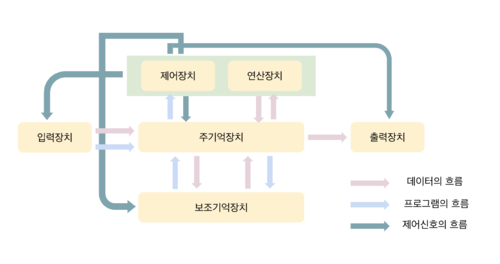

# 보조기억장치와 데이터 저장

1. 대용량의 기억장치가 필요
2. 비휘발성 기억장치가 필요 : 전원 공급 없이 데이터를 보관할 수 있어야함
3. 주기억장치의 효율적 사용 : 지역성 원리의 활용. 필요한 부분만 주기억장치에 저장하고 나머지는 보조기억장치에 저장

## 기억장치 계층구조

1. CPU (레지스터)
2. 캐시메모리
3. 주기억장치
4. 보조기억장치

## 자기테이프 기억장치

ex) LTO (Linear Tape-Open)

백업, 자주 사용되지 않는 데이터의 저장 등의 용도로 활용됨

순차접근 기억장치
* 물리적 순서에 따라 데이터를 저장함
* 기록한 순서에 따라 읽을 수 있음

원하는 위치에 신속하게 접근할 수 없음
* 대화식 처리에 직접 사용하기에 적합하지 않음
* 데이터의 백업용으로 사용함

## 자기디스크 기억장치

자성체가 코팅된 원판 형태의 기록 매체 위에서 헤드를 움직여 원하는 위치에 접근하는 직접접근 저장장치

### 직접접근 저장장치

* 데이터의 위치를 지정하여 데이터를 저장하거나 읽어낼 수 있는 저장장치
* 대화식 처리를 위한 빠른 데이터 처리를 위해서는 직접접근 저장장치가 필요함

플로피디스크. 최근에는 USB 플래시 드라이브 등으로 대체됨

#### 하드디스크 

회전축에 여러장의 디스크가 결합되어 회전. 액추에이터 암에 결합된 헤더로 데이터를 읽음

성능

* 탐색시간 : 헤드가 지정된 트랙으로 이동하는 시간 (수 ms)
* 회전지연시간 : 디스크가 회전하여 데이터 위치가 헤드에 도달하는 시간 (7.1 ~ 2ms)
* 전송시간 : 주기억장치와 하드디스크 사이에 데이터를 전송하는데 소비되는 시간

디스크 어레이 : 여러개의 하드디스크에 데이터를 분산하여 저장하는 장치

## 광 디스크

* 레이저를 이용하여 기록면에서 데이터를 읽음
* 한장의 마스터로부터 대용량 데이터를 인쇄하듯 찍어내어 대량생산이 가능함

* CLV(Constant Linear Velocity) 형식 : 디스크 중앙에서 바깥쪽으로 향하는 나선형 트랙. CAV 방식에 비해 직접접근 속도가 느림. 오디오/비디오에 적합
* CAV(Constant Angular Velocity) 형식 : 자기디스크에서 주로 사용되는 방식. 집적접근을 빠르게 할 수 있음. 단 데이터의 밀도가 감소하기때문에 디스크 용량을 최대로 활용하지 못함

ROM(Read Only Memory)
* 제작 단계에서 한 번만 기록 가능
* 내용의 추가나 수정 불가

WORM(Write Once Read Many)
* 공백 상태로 제작된 디스크에 1회에 한해 기록할 수 있음
* 데이터의 영구적 기록을 위해 사용

RW(ReWritable)
* 디스크에 반복적으로 쓰고 지울 수 있음
* 약 1,000 회 정도의 재기록이 가능

### CD (Compact Disc)

오디오 용으로 개발된 매체이나, 이후 데이터 저장용으로도 활용됨

650MB ~ 700MB 

### DVD (Digital Versatile Disc)

Versatile : 다용도의 

고화질 영화를 저장하기 위한 기록매체로 개발됨 (당시 720 * 480)

CD에 비해 파장이 짦은 적색 레이저를 사용하여 기록 용량을 높임. 저장 용량 : 4.7GB ~ 8.5GB

### Blu-ray disc

고선명 비디오를 저장하기위한 디지털 기록 매체

DVD에 비해 파장이 더욱 짦은 청색 반도체 레이저를 사용하여 DVD 의 저장용량을 높임 (25GB ~ 128GB)

## 반도체 기억장치

### USB 플래시 드라이브

플래시 메모리(flash memory) + USB(universal serial bus)

bus : 통로를 의미함

* 컴퓨터가 켜진 상태에서 자유롭게 연결과 분리가 가능함
* 크기가 작고 가벼워 휴대용 저장장치로 적합함

SLC 방식 (Single Level Cell)
* 1개의 기억소자에 1개의 비트를 저장함
* 안정성이 높고 데이터 처리 속도가 빠름
* 가격이 높음

MLC 방식 (Multi Level Cell)
* 1개의 기억소자에 2개의 비트 이상을 저장함 (DLC, TLC, QLC)
* 안정성과 속도가 낮음
* 가격이 저렴함

### SSD (Solid-State Drive)

* 자기디스크와 동일한 인터페이스를 가지나, 디스크 대신 반도체 메모리를 사용하여 데이터를 저장함
* 플래시 메모리를 이용하는 방식과 DRAM과 배터리를 사용하는 방식이 있음. 주로 플래시 메모리를 사용함

#### 자기디스크와 비교한 장점과 단점

장점
* 내구성이 강하고 전력소모가 적음
* 기계적인 움직임이 없어 데이터를 읽는시간이 매우 빠름
* 무게가 가벼움

단점
* 기록과 삭제 횟수가 한정되어 수명이 짦음
* 데이터 기록 시 먼저 블록 삭제를 한 후 쓰기를 수행해야 하므로 읽기와 쓰기 속도가 비대칭임
* 가격이 비쌈

## 클라우드 저장장치

### 클라우드 컴퓨팅 (cloud computing)

인터넷을 기반으로 하여 컴퓨터의 계산능력, 저장공간, 서비스 등 다양한 컴퓨터의 자원을 언제 어디서나 필요한만큼 이용하여 비용을 지불하는 컴퓨팅 방식

### 클라우드 저장장치 (cloud storage)

* 서비스를 제공하는 사업자는 다수의 분산된 저장장치로 거대한 저장공간을 구성
* 사용자 (기업이나 기관, 개인 등)는 서비스를 제공자와의 계약을 통해 사용량에 따른 비용을 지불하고 사용

### 파일 호스팅 서비스 (file hosting service)

* 사용자에게 파일 저장 공간을 제공하는 인터넷 호스팅 서비스

