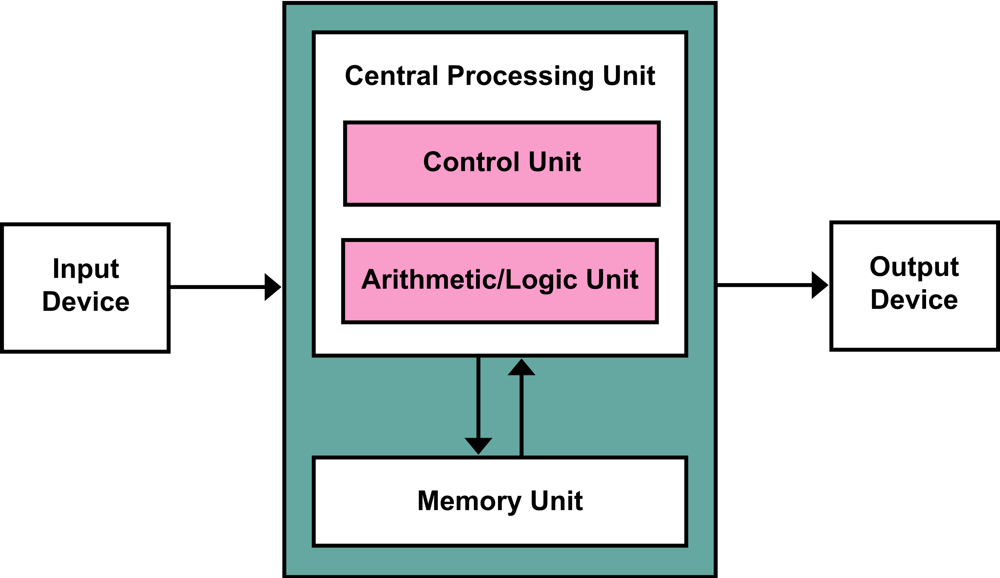
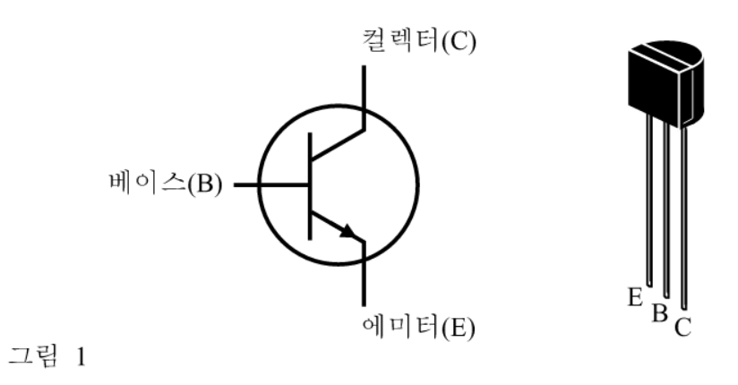

# 요약

1. 정보사회와 컴퓨터
2. 컴퓨터와 통신산업의 발전
3. 처리장치와 데이터 처리
4. 컴퓨터의 입출력
5. 보조기억장치와 데이터 저장

## 컴퓨터

컴퓨터 : 사람이 개입하지 않고도 산술 및 논리연산을 수행할 수 있는 장치

컴퓨터 시스템 : 특정한 작업을 수행하기 위해 필요한 기능을 가지는 하나 또는 여러 개의 요소가 연결된 개체를 의미

컴퓨터 시스템의 하드웨어
* 입력장치
* 출력장치
* 중앙처리장치
* 기억장치

소프트웨어 : 사람이 컴퓨터에게 작업을 지시하거나 하드웨어와 이용자 사이에서 이용자가 하드웨어를 의식하지 않고 쉽게 이용할 수 있도록 매개체 역할을 수행하는 프로그램들의 집합

* 데이터(data) : 정보로 추출되어지기 전의 가공되지 않은 것
* 정보(information) : 어떤 매개체에 의해 집대성되고 의미 있는 것으로 처리되어 가공된 데이터 (전체 평균, 시간 별 방문 고객 수 등)

컴퓨터의 5대 기능 : 입력, 출력, 기억, 제어, 계산

## 컴퓨터산업의 발전단계

최초의 컴퓨터 : ABC 컴퓨터

* 1세대 : 진공관(vacuum tube) 시대
* 2세대 : 트랜지스터(transistor) 시대
* 3세대 : 집적회로(integrated circuit) 시대
* 4세대 : 초고밀도 집적회로(very large scale integrated circuit) 시대

## 처리장치

처리장치는 중앙처리장치와 주기억장치로 구성됨

중앙처리장치는 제어장치와 산술논리연산장치로 구성됨

## 데이터

8bit(1byte) 로 256개의 경우의 수를 표기

* ASCII 은 1byte 로 문자를 표현한다.
* 유니코드는 2byte 로 문자를 표현한다.

기억 용량의 단위 : 1KB = 2^10 byte, 1MB = 2^20 byte ...

* 필드(field) : 데이터를 구성하는 하나의 단위
* 레코드(record) : 여러 필드의 모임, 하나의 처리 단위

